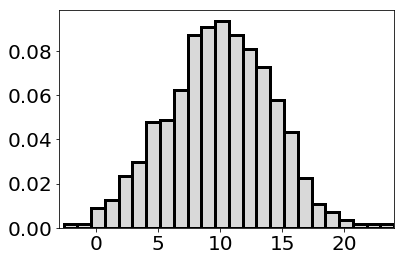
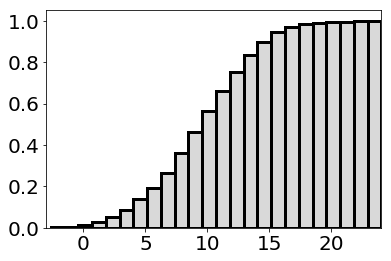
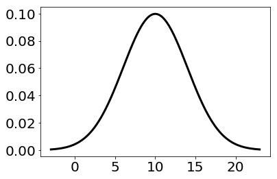
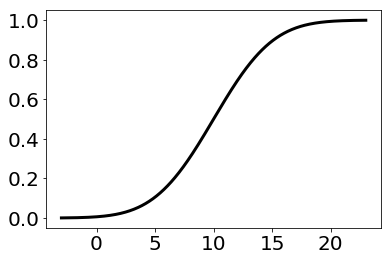

```python
import numpy as np
import matplotlib.pyplot as plt
import seaborn as sns
import matplotlib.mlab as mlab

from sklearn.mixture import GMM
from sklearn.mixture import GaussianMixture
from scipy import stats, integrate

from scipy.stats import multivariate_normal as mvn
from scipy.stats import norm
import pandas as pd
```


```python
data = np.random.normal(10, 4, 1000)
```


```python
data.shape
```


    (1000L,)


```python
plt.figure(figsize=(6,4))

sns.distplot(data, hist=True, hist_kws={"histtype":"bar","color":'#d9d9d9', "linewidth":3, "edgecolor":'k', "alpha":1, "normed":1, "cumulative":0}, kde=0, kde_kws={"linewidth":4, "color":"#cceeff", "shade":True, "alpha":1, "bw":1})

#sns.rugplot(data, color="#ff4d4d", lw=2)
plt.xlim(-3,24)
#plt.xlabel('xlabel', fontsize=18)
#plt.ylabel('ylabel', fontsize=16)
plt.xticks(fontsize=20)
plt.yticks(fontsize=20)
plt.savefig("svgFolder/4_inverseCDF_1.svg")
plt.show()
```





```python
plt.figure(figsize=(6,4))

sns.distplot(data, hist=True, hist_kws={"histtype":"bar","color":'#d9d9d9', "linewidth":3, "edgecolor":'k', "alpha":1, "normed":1, "cumulative":1}, kde=0, kde_kws={"linewidth":4, "color":"#cceeff", "shade":True, "alpha":1, "bw":1})

#sns.rugplot(data, color="#ff4d4d", lw=2)
plt.xlim(-3,24)
#plt.xlabel('xlabel', fontsize=18)
#plt.ylabel('ylabel', fontsize=16)
plt.xticks(fontsize=20)
plt.yticks(fontsize=20)
plt.savefig("svgFolder/4_inverseCDF_2.svg")
plt.show()
```





```python
support = np.linspace(-3, 23, 500)


gauss1 = stats.norm(10, 4).pdf(support)

plt.figure(figsize=(6,4))
plt.plot(support, gauss1, color="k", lw=3)
#sns.rugplot(x_data, color="#ff4d4d", lw=2)
#plt.xlim(7.5,24)
#plt.xlabel('xlabel', fontsize=18)
#plt.ylabel('ylabel', fontsize=16)
plt.xticks(fontsize=20)
plt.yticks(fontsize=20)
plt.savefig("svgFolder/4_inverseCDF_3.svg")
plt.show()
```





```python

gauss2 = stats.norm(10, 4).cdf(support)

plt.figure(figsize=(6,4))
plt.plot(support, gauss2, color="k", lw=3)
#sns.rugplot(x_data, color="#ff4d4d", lw=2)
#plt.xlim(7.5,24)
#plt.xlabel('xlabel', fontsize=18)
#plt.ylabel('ylabel', fontsize=16)
plt.xticks(fontsize=20)
plt.yticks(fontsize=20)
plt.savefig("svgFolder/4_inverseCDF_4.svg")
plt.show()
```




